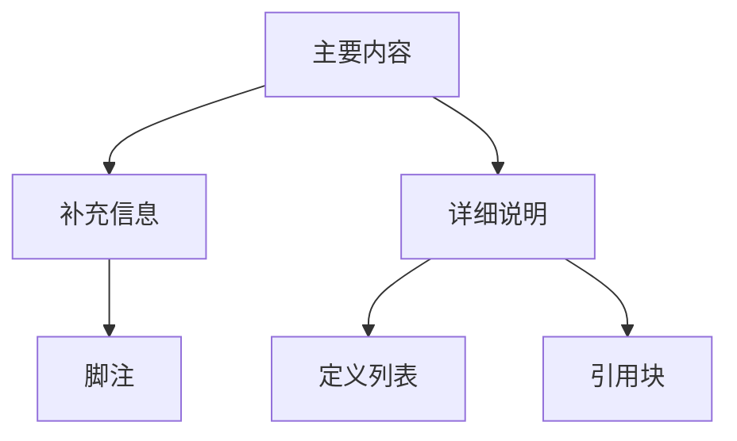
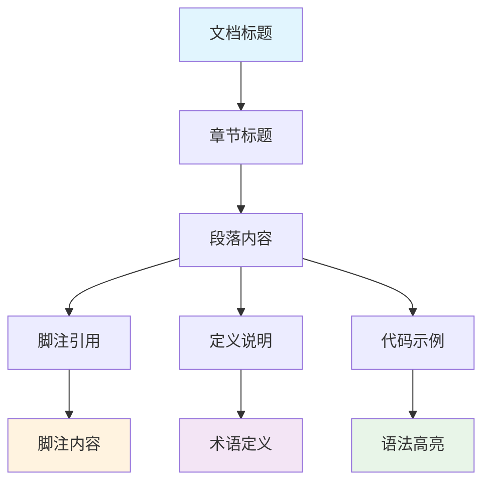

# 🚀 高级语法

Markdown 的魅力不仅在于其简洁的基础语法，更在于其丰富的扩展功能。本章将深入探讨各种高级特性，让你的文档更加专业和实用。

## 📝 脚注 (Footnotes)

脚注是学术写作和专业文档的重要组成部分，它们允许你添加补充信息而不打断主要内容的流畅性。

### 基础脚注

这是一个包含脚注的段落[^1]。你可以在文档的任何地方定义脚注[^note-id]。

[^1]: 这是第一个脚注的内容。脚注可以包含多行文本，甚至包含其他 Markdown 元素。

[^note-id]: 这是一个使用自定义 ID 的脚注。脚注 ID 可以是数字或文字。

### 复杂脚注

脚注支持复杂的内容结构[^complex]：

[^complex]:
    这是一个复杂的脚注，包含：

    - 列表项目
    - **粗体文本**
    - `行内代码`

    甚至可以包含代码块：
    ```javascript
    function example() {
        return "脚注中的代码";
    }
    ```

### 内联脚注

某些 Markdown 处理器支持内联脚注^[这是一个内联脚注，内容直接写在文本中]，这样可以保持内容的紧密性。

## 📖 定义列表 (Definition Lists)

定义列表是表达术语和概念的优雅方式，特别适用于词汇表、API 文档和技术说明。

### 基础定义列表

Markdown
:   轻量级标记语言，由 John Gruber 创建于 2004 年。
:   设计目标是易读易写，同时具备足够的表现力。

Git
:   分布式版本控制系统
:   由 Linus Torvalds 开发，用于 Linux 内核开发

### 复杂定义列表

RESTful API
:   **表述性状态传递**（Representational State Transfer）的应用程序接口
:   基于 HTTP 协议的架构风格
:   特点包括：
    - 无状态性
    - 统一接口
    - 可缓存性
    - 分层系统

GraphQL
:   数据查询和操作语言
:   由 Facebook 开发，于 2015 年开源
:   相比 REST API 的优势：
    1. 精确获取数据
    2. 强类型系统
    3. 内省能力

## 🏷️ 标签和属性 (Tags and Attributes)

### 自定义 ID 和类名

某些 Markdown 扩展支持为元素添加自定义属性：

#### 标题属性 {#custom-heading-id}

段落也可以添加属性 {.highlight-text}

### 属性列表语法

使用花括号语法为元素添加属性：

```markdown
这是一个段落{.warning}

{.responsive width="300"}

[链接](http://example.com){target="_blank" rel="noopener"}
```

## 📋 任务列表扩展

### 优先级任务列表

- [x] 🔴 高优先级：完成用户认证模块
- [x] 🟡 中优先级：优化数据库查询性能
- [ ] 🟢 低优先级：添加暗色主题支持
- [ ] 🔵 规划中：移动端适配

### 分配任务列表

- [x] @张三 设计用户界面原型
- [x] @李四 实现后端 API 接口
- [ ] @王五 编写单元测试用例
- [ ] @赵六 部署生产环境

### 带截止日期的任务

- [x] 📅 2025-09-15 完成需求分析文档
- [x] 📅 2025-09-20 设计系统架构
- [ ] 📅 2025-09-25 开发核心功能
- [ ] 📅 2025-09-30 集成测试

## 🏷️ 标记和高亮

### 高亮文本

使用双等号==高亮重要内容==，这在文档审阅时特别有用。

### 下标和上标

化学公式：H~2~O，数学表达式：E=mc^2^

### 键盘按键

使用 <kbd>Ctrl</kbd> + <kbd>C</kbd> 复制文本，<kbd>Cmd</kbd> + <kbd>V</kbd> 粘贴内容。

## 📊 表格扩展语法

### 跨行跨列表格

虽然标准 Markdown 不支持，但某些扩展允许复杂表格：

| 功能分类 | 功能名称 | 开发状态 | 负责人 |
|----------|----------|----------|---------|
| 用户管理 | 用户注册 | ✅ 完成 | 张工程师 |
|          | 用户登录 | ✅ 完成 | 张工程师 |
|          | 密码重置 | 🟡 进行中 | 李工程师 |
| 内容管理 | 文章发布 | 📋 计划中 | 王工程师 |
|          | 评论系统 | 📋 计划中 | 王工程师 |

### 表格内的复杂内容

| 特性 | 示例 | 说明 |
|------|------|------|
| 列表 | • 项目1<br>• 项目2<br>• 项目3 | 使用 `<br>` 换行 |
| 代码 | `const x = 1`<br>`function f() {}` | 支持行内代码 |
| 链接 | [官网](https://example.com)<br>[文档](https://docs.example.com) | 多个链接 |

## 🔗 引用和交叉引用

### 内容引用

> **设计原则**
>
> 优秀的用户界面设计应该遵循以下原则：
>
> 1. **一致性** - 保持界面元素的一致性
> 2. **简洁性** - 去除不必要的复杂性
> 3. **可用性** - 确保用户能够轻松使用
>
> — Jakob Nielsen, 可用性工程学

### 嵌套引用与列表

> **项目管理最佳实践**
>
> > **敏捷开发核心价值观：**
> >
> > - 个体和互动胜过流程和工具
> > - 工作的软件胜过详尽的文档
> > - 客户合作胜过合同谈判
> > - 响应变化胜过遵循计划
>
> 这些价值观指导着现代软件开发团队的实践。

## 📝 警告和提示框

虽然这不是标准 Markdown，但许多扩展支持特殊的提示框语法：

### 信息提示

> **💡 提示**
>
> 这是一个信息提示框，用于提供有用的信息和建议。

### 警告信息

> **⚠️ 警告**
>
> 这是一个警告框，用于提醒用户注意重要事项。

### 危险提示

> **🚫 危险**
>
> 这是一个危险提示框，用于警告可能造成损害的操作。

### 成功信息

> **✅ 成功**
>
> 这是一个成功提示框，用于确认操作已成功完成。

## 📊 数据和统计

### 进度条表示

项目进度：
- 需求分析 ████████████████████ 100%
- 设计阶段 ████████████████░░░░ 80%
- 开发实现 ████████░░░░░░░░░░░░ 40%
- 测试验收 ░░░░░░░░░░░░░░░░░░░░ 0%

### 数据表格

| 指标 | Q1 | Q2 | Q3 | Q4 | 年度总计 |
|------|----|----|----|----|----------|
| 收入 | 25万 | 30万 | 35万 | 40万 | **130万** |
| 支出 | 20万 | 22万 | 25万 | 28万 | **95万** |
| 利润 | 5万 | 8万 | 10万 | 12万 | **35万** |

## 💭 深度思考：高级语法的认知科学

### 1. **信息层次化原理**

高级语法工具帮助我们构建清晰的信息层次：



- **脚注** - 提供补充信息而不打断主要叙述
- **定义列表** - 建立术语和概念的明确映射
- **引用** - 增加内容的权威性和可信度

### 2. **认知负荷管理**

高级语法通过分层信息减少认知负荷：

- **渐进式披露** - 主要内容在前，详细信息在后
- **视觉分离** - 通过格式区分不同类型的信息
- **上下文相关** - 相关信息就近放置

### 3. **语义化表达**

每种高级语法都有其特定的语义意义：

| 语法元素 | 语义意义 | 认知作用 |
|----------|----------|----------|
| 脚注 | 补充说明 | 保持主线流畅 |
| 定义列表 | 概念解释 | 建立概念框架 |
| 任务列表 | 行动项目 | 促进执行 |
| 高亮标记 | 重点强调 | 吸引注意力 |

### 4. **文档架构思维**

高级语法支持复杂的文档架构：



## 🛠️ 实用技巧

### 1. **组织复杂信息**

使用嵌套引用和列表处理多层次信息：

> **系统架构设计**
>
> - **前端层**
>   > - React.js 用户界面
>   > - Redux 状态管理
>   > - React Router 路由系统
>
> - **后端层**
>   > - Node.js 服务器
>   > - Express.js 框架
>   > - MongoDB 数据库

### 2. **知识管理**

用定义列表建立概念词汇表：

API (Application Programming Interface)
:   应用程序编程接口，不同软件组件之间的通信协议

SDK (Software Development Kit)
:   软件开发工具包，包含开发特定软件所需的工具集合

Framework
:   软件框架，为软件开发提供基础结构和标准

Library
:   程序库，提供特定功能的可重用代码集合

### 3. **项目管理**

使用扩展任务列表跟踪项目进度：

#### Sprint 1 (2025-09-17 - 2025-09-24)
- [x] 🏗️ @前端团队 搭建项目基础架构
- [x] 🎨 @设计师 完成 UI 设计稿
- [ ] ⚡ @后端团队 实现用户认证 API
- [ ] 📱 @前端团队 开发用户登录界面

#### Sprint 2 (2025-09-24 - 2025-10-01)
- [ ] 📊 @后端团队 开发数据统计功能
- [ ] 🔍 @前端团队 实现搜索功能
- [ ] 🧪 @测试团队 编写自动化测试

## 📈 最佳实践

### 1. **脚注使用原则**
- 用于补充信息，不要放置核心内容
- 脚注编号按出现顺序排列
- 保持脚注内容简洁明了

### 2. **定义列表设计**
- 术语简洁准确，定义完整清晰
- 按字母顺序或重要性排列
- 避免循环定义

### 3. **任务列表管理**
- 使用动词开头描述任务
- 添加负责人和截止日期
- 定期更新完成状态

### 4. **信息层次化**
- 主要内容在主体，补充信息用脚注
- 重要概念用定义列表解释
- 行动项目用任务列表跟踪

---

*下一章：[代码和语法高亮](./code-and-highlighting.md) - 展示代码的艺术*