# 📊 图表和可视化

在现代文档中，图表和可视化是传达复杂信息的强大工具。HyperRead 支持 Mermaid 图表库，让你能够用代码创建专业的图表和图形。

## 🔄 流程图 (Flowchart)

### 基础流程图

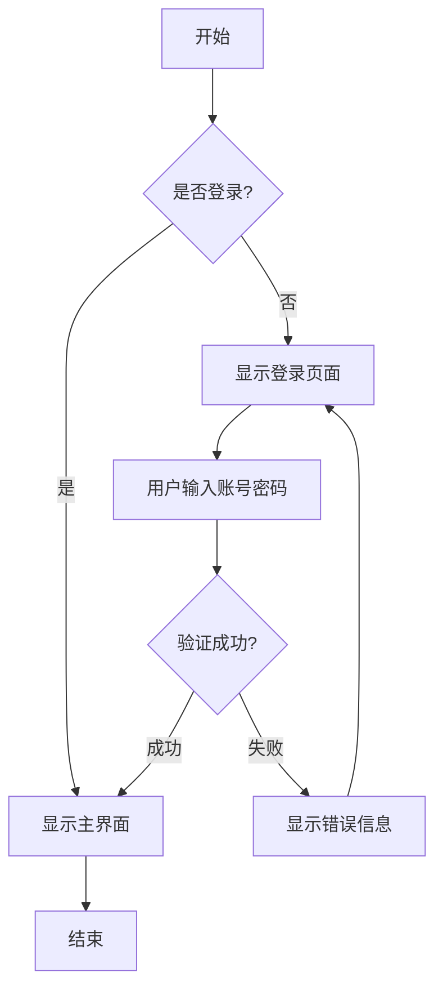

### 软件开发流程

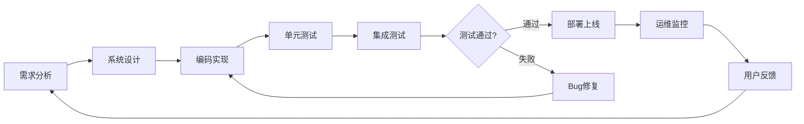

### 复杂业务流程

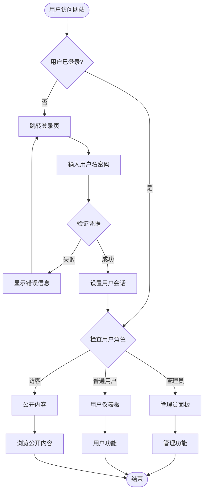

## 📈 时序图 (Sequence Diagram)

### API 调用时序图

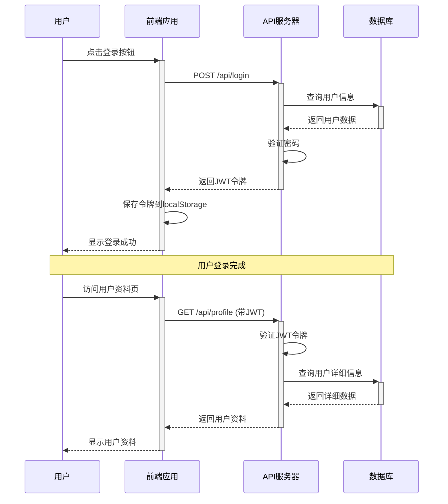

### 微服务架构时序图

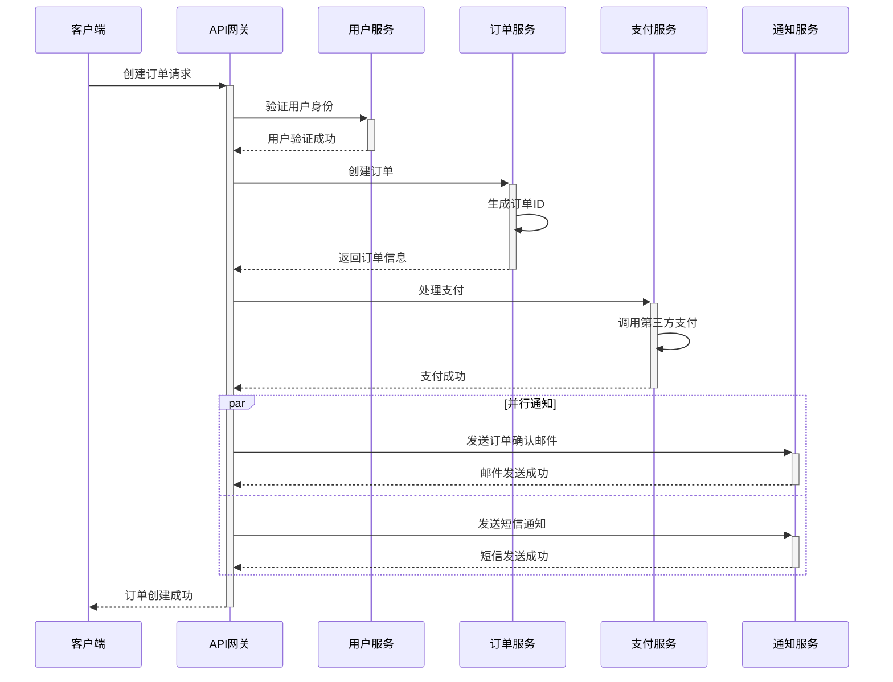

## 🏗️ 类图 (Class Diagram)

### 用户管理系统类图

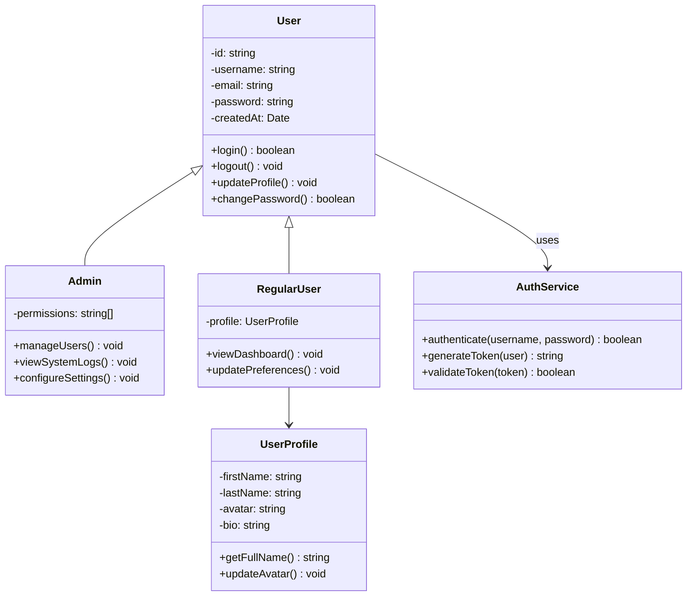

### 电商系统核心类图

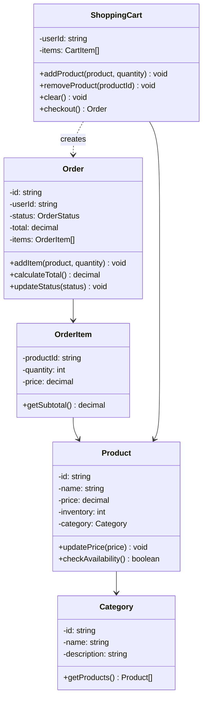

## 📊 甘特图 (Gantt Chart)

### 项目开发计划

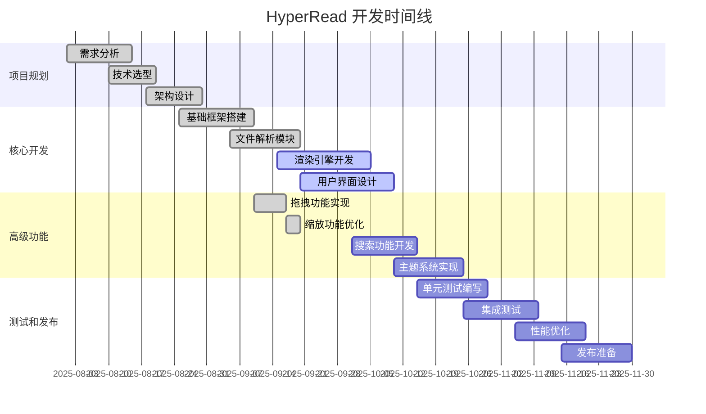

### 学习计划甘特图

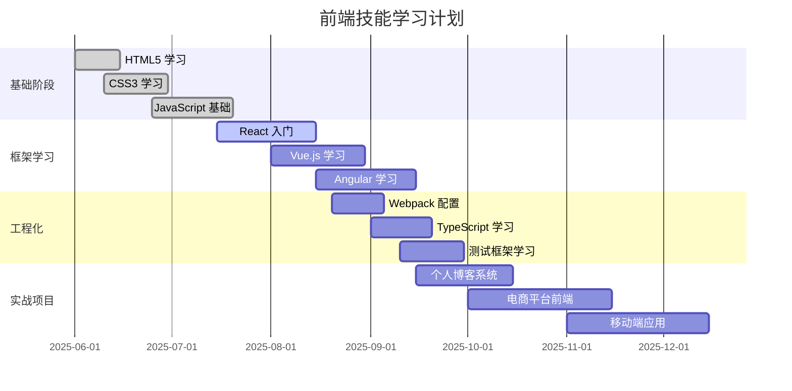

## 🌊 状态图 (State Diagram)

### 订单状态流转

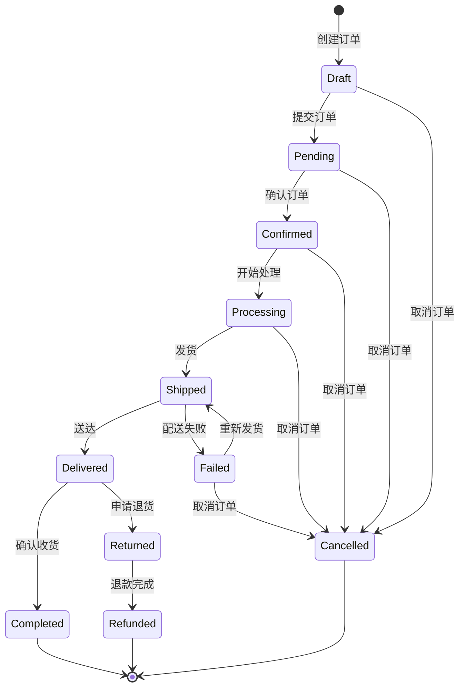

### 用户登录状态

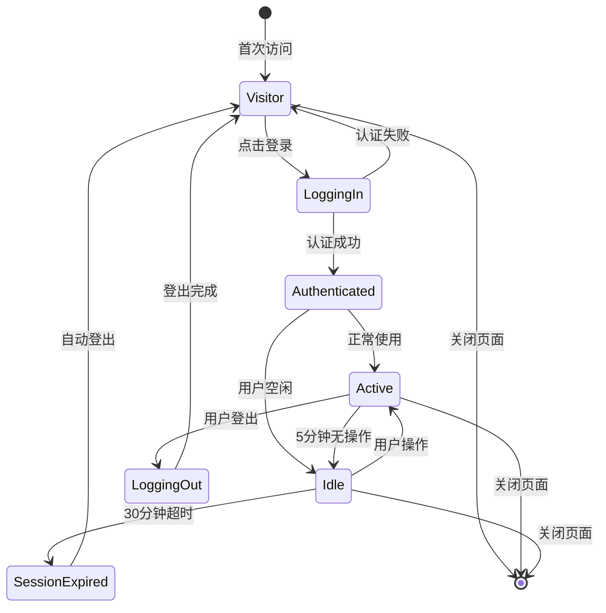

## 🎯 Git 工作流图

### Git Flow 分支策略

```mermaid
gitgraph
    commit id: "初始化"
    branch develop
    checkout develop
    commit id: "开发环境搭建"

    branch feature/user-auth
    checkout feature/user-auth
    commit id: "添加登录功能"
    commit id: "添加注册功能"

    checkout develop
    merge feature/user-auth
    commit id: "合并用户认证功能"

    branch feature/file-management
    checkout feature/file-management
    commit id: "文件上传功能"
    commit id: "文件列表显示"

    checkout develop
    merge feature/file-management
    commit id: "合并文件管理功能"

    branch release/v1.0
    checkout release/v1.0
    commit id: "版本1.0准备"
    commit id: "修复发现的bug"

    checkout main
    merge release/v1.0
    commit id: "发布v1.0" tag: "v1.0"

    checkout develop
    merge main
    commit id: "同步主分支"
```

## 🏛️ 实体关系图 (ER Diagram)

### 博客系统数据库设计

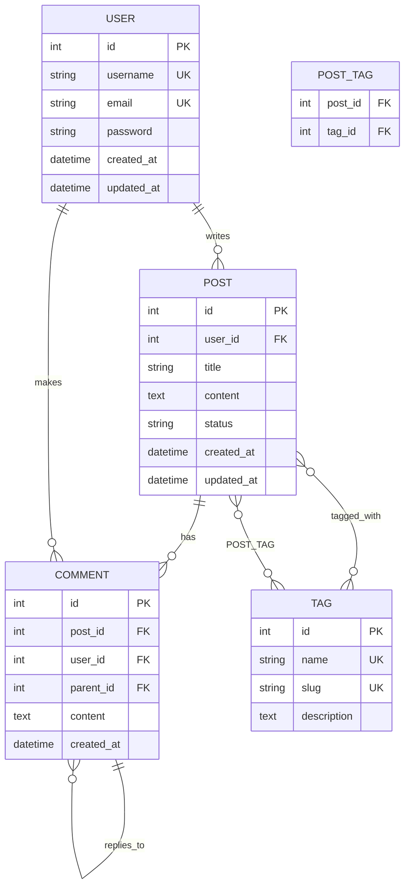

## 💭 深度思考：可视化的认知科学

### 1. **视觉认知原理**
- **图形胜过文字** - 人脑处理图像比文字快60,000倍
- **空间记忆** - 位置关系帮助记忆和理解
- **模式识别** - 图表帮助识别数据中的模式和趋势

### 2. **信息架构可视化**
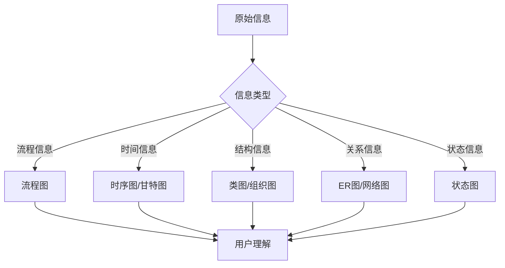

### 3. **图表选择决策树**
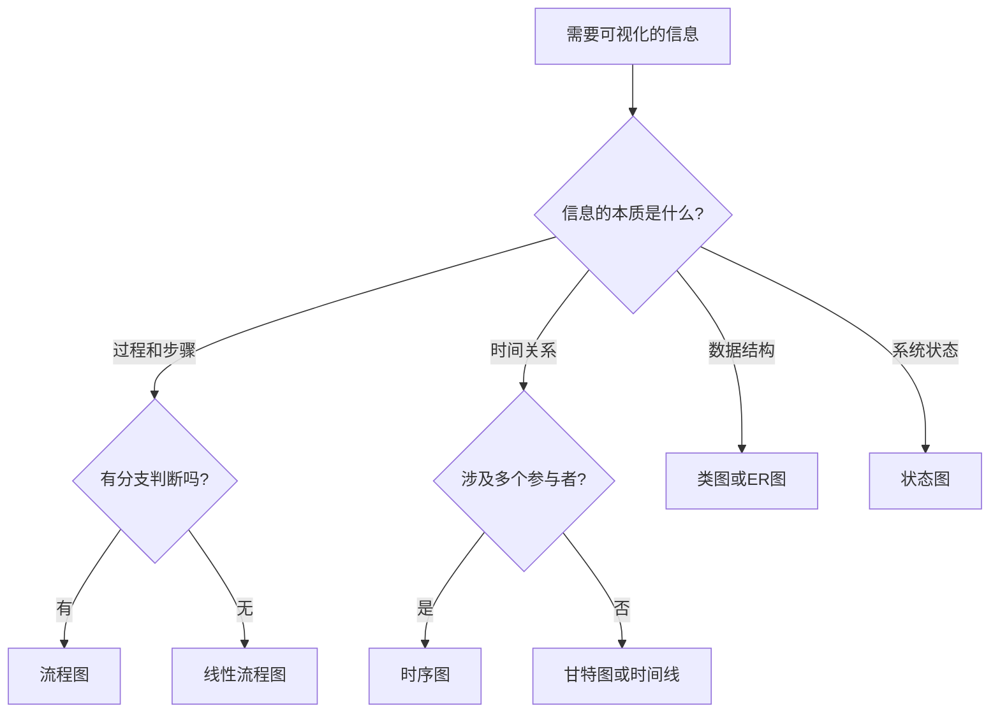

### 4. **图表设计原则**

#### 简洁性原则 (Less is More)
- 移除不必要的装饰元素
- 突出关键信息和关系
- 使用一致的视觉语言

#### 层次性原则 (Hierarchy)
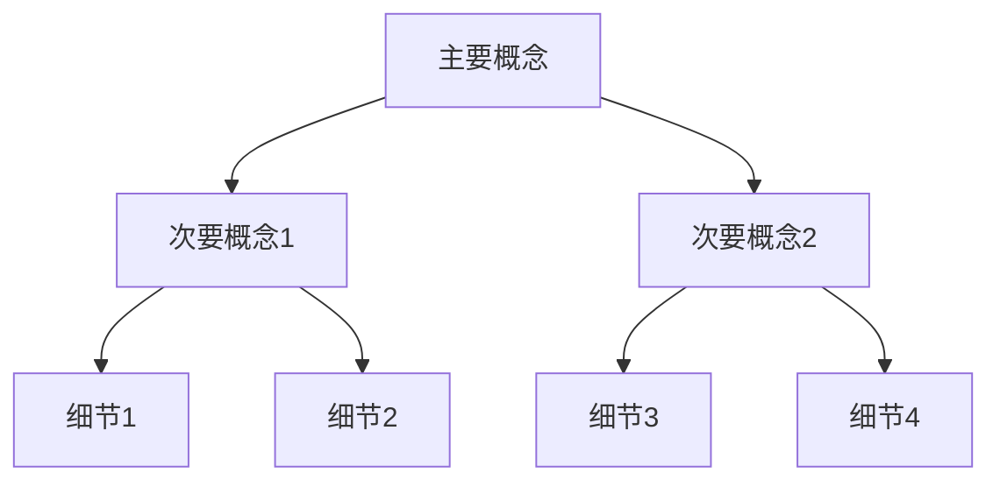

#### 一致性原则 (Consistency)
- 相同概念使用相同视觉表示
- 保持颜色、形状、大小的一致性
- 统一的命名和标注规范

## 🎨 图表美学指南

### 颜色使用建议
1. **功能性色彩**
   - 🔴 红色：错误、警告、终止状态
   - 🟢 绿色：成功、完成、正常状态
   - 🟡 黄色：警告、等待、进行中
   - 🔵 蓝色：信息、流程、中性状态

2. **语义化色彩**
   - 保持品牌色彩一致性
   - 考虑文化背景中的色彩含义
   - 确保色彩对比度足够（无障碍设计）

### 布局设计原则
1. **从左到右，从上到下** - 符合阅读习惯
2. **重要元素突出** - 使用大小、颜色、位置强调
3. **留白平衡** - 适当的空白增强可读性
4. **对齐规范** - 保持元素的视觉对齐

---

*下一章：[代码和语法高亮](./code-and-highlighting.md) - 代码展示的艺术*