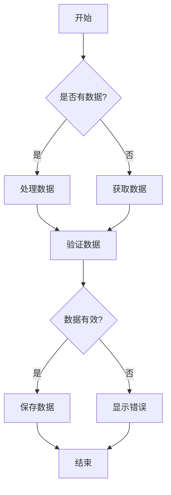
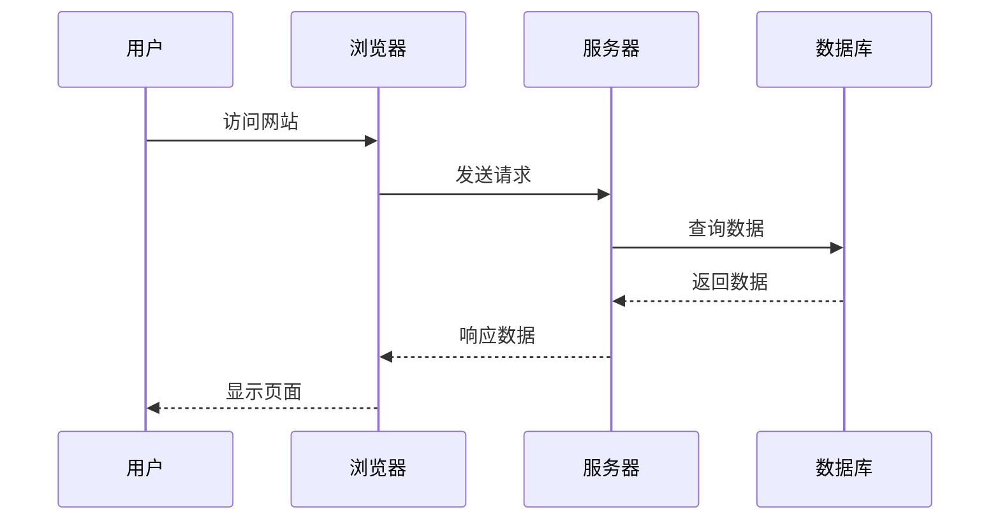
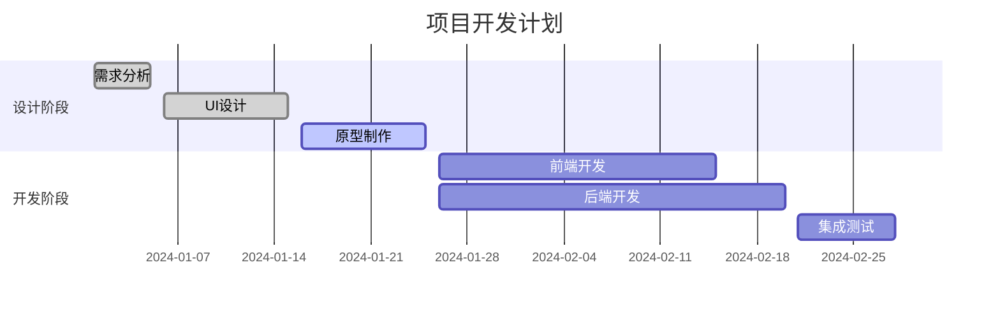

# Mermaid 图表缩放测试

这个文档包含各种 mermaid 图表，用于测试新的缩放控制功能。

## 流程图

## 序列图

## 甘特图

## 使用说明

1. 点击图表右上角的 **全屏按钮** 进入全屏模式
2. 在全屏模式下，您可以：

### 🖱️ 拖拽功能 (NEW!)
   - 点击左下角的 **手型按钮** (👋) 开启/关闭拖拽模式
   - 开启拖拽模式后，鼠标光标会变成手型
   - 点击并拖拽图表可以移动查看不同区域
   - 拖拽模式开启时会显示 "拖拽" 状态指示

### 🔍 缩放功能
   - 点击左下角的 **放大按钮** (+) 放大图表
   - 点击左下角的 **缩小按钮** (-) 缩小图表
   - 点击左下角的 **重置按钮** (↶) 重置缩放和位置到初始状态
   - 查看当前缩放百分比

## 预期功能

- ✅ **按钮缩放控制** (0.1x - 5.0x 范围)
- ✅ 缩放重置功能
- ✅ 实时显示缩放百分比
- ✅ 平滑缩放动画
- ✅ **拖拽手势控制**
- ✅ **智能光标变化** (默认/手型/抓取)
- ✅ **拖拽状态指示**
- ✅ **组合操作** (缩放后拖拽查看不同区域)
- ❌ ~~滚轮缩放~~ (已移除)

## 最新改进 (NEW!)

### 🔧 固定控制台位置
- **固定左下角**: 控制台现在固定在屏幕左下角，滚动图表时不会移动
- **更高对比度**: 背景透明度从 80% 增加到 90%，提高可见性
- **更高层级**: 使用 z-20 确保控制台始终在最前面

### ⚡ 优化拖拽体验
- **消除刷新感**: 拖拽时移除过渡动画，避免图表"闪烁"
- **性能优化**: 使用 requestAnimationFrame 提升拖拽平滑度
- **即时响应**: 拖拽移动时立即应用变换，无延迟

## 操作建议

1. **放大后拖拽**: 先放大图表，然后开启拖拽模式移动查看细节
2. **重置位置**: 使用重置按钮可以同时重置缩放和拖拽位置
3. **切换模式**: 可以随时开启/关闭拖拽模式，不会影响当前缩放级别
4. **固定控制**: 无论如何滚动图表，控制台始终在左下角可访问